# Zenow User Guide

**Zenow** is a locally-running AI knowledge assistant desktop application. All data processing is done locally to fully protect your privacy. It supports multi-model management, intelligent conversations, knowledge base Q&A, voice interaction, and more.

## Product Features

- **Privacy Protection**: All data processed locally, never uploaded to the cloud
- **Multi-Model Support**: Run LLM, Embed, and Rerank models simultaneously
- **Knowledge Base Q&A**: Intelligent Q&A based on local documents
- **Voice Interaction**: Support for voice input and text-to-speech
- **Multi-Turn Conversations**: Continuous dialogue with context memory

## Platform Support

| Platform & System     | Hardware Acceleration |
|-----------------------|-----------------------|
| K1 Buildroot          | ❌ Not Supported      |
| K1 OpenHarmony5.0     | ❌ Not Supported      |
| K3 Bianbu LXQT/GNOME  | ✅ Supported          |

## Technical Architecture

### Core Technology Stack

Zenow is built on the following core technologies:

- **[LLM SDK](https://www.spacemit.com/community/document/info?lang=en&nodepath=software/SDK/bianbu/ai/llmsdk.md)** - Large Language Model Inference Engine
  - Multi-turn conversations
  - Knowledge base Q&A

- **[Speech SDK](https://www.spacemit.com/community/document/info?lang=en&nodepath=software/SDK/bianbu/ai/speechsdk.md)** - Speech Processing Engine
  - Automatic Speech Recognition (ASR)
  - Text-to-Speech (TTS)
  - Wake Word Detection ("Xiao Die Xiao Die")

- **Frontend Framework**
  - Electron - Cross-platform desktop application framework
  - React + TypeScript - User interface
  - Vite - Build tool

- **Backend Framework**
  - FastAPI - High-performance API service
  - Python - Runtime environment
  - SQLite - Local data storage

### System Architecture Diagram

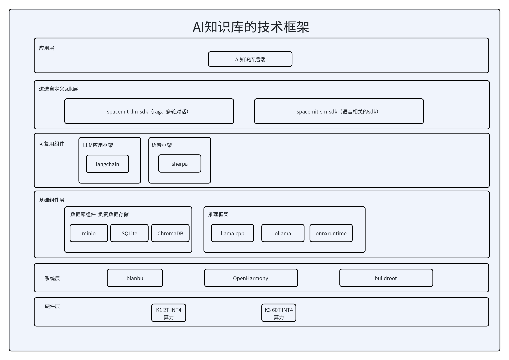


### Workflow

1. **Conversation Flow**: User input → Frontend → Backend session management → LLM Server → Streaming response
2. **Knowledge Base Q&A**: User question → RAG retrieval (Embed + BM25) → Rerank sorting → LLM generates answer
3. **Voice Interaction**: Voice input → Speech SDK ASR → Text processing → LLM generation → Speech SDK TTS → Voice output

## Installation

Run the following commands in the terminal to install Zenow and its dependencies:

```bash
sudo apt update
sudo apt install zenow llm-sdk sm-sdk
```

## Quick Start

### 1. Launch the Application

Click the menu in the bottom-left corner, search for **zenow**, and click to launch.

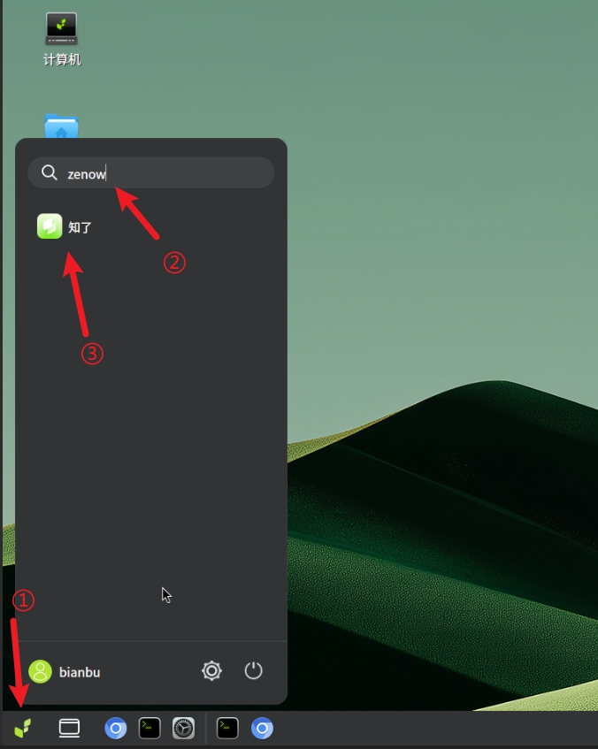

> 💡 **Tip**: Right-click the app icon and select "Add to Desktop" and trust it for quick access next time.

### 2. Download Models

First-time users need to download AI models:

1. Click the **Settings** icon in the left navigation bar
2. Select the desired model from the model list
3. Click the model name to start downloading

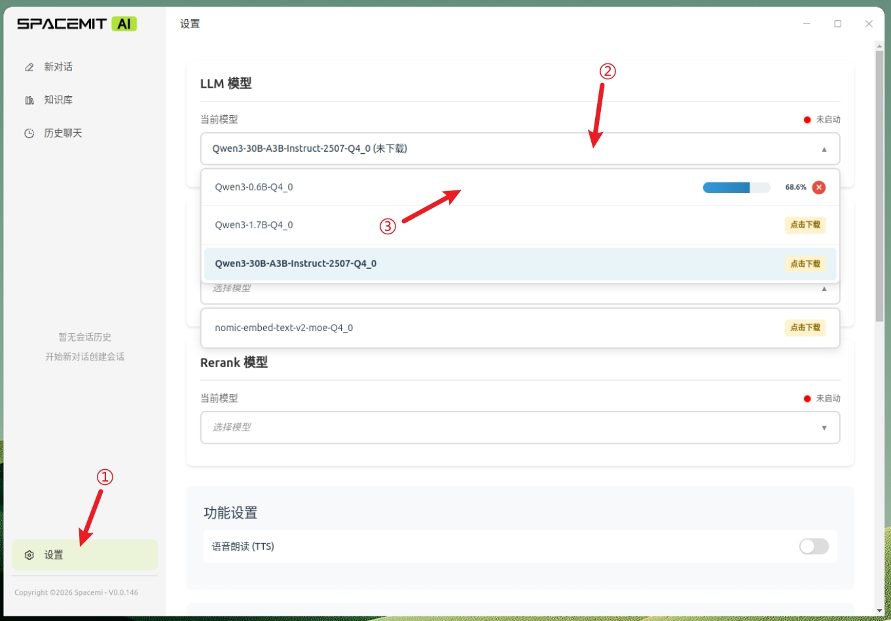

Multiple models can be downloaded simultaneously:


### 3. Start Models

After downloading, click the model name again to start:

- **Red light**: Model not started
- **Yellow light**: Model starting
- **Green light**: Model ready


> ⚠️ **Important**: To use the full knowledge base functionality, it is recommended to download and start at least one model of each type:
> - **LLM Model**: For conversation generation
> - **Embed Model**: For text vectorization
> - **Rerank Model**: For result sorting

## Features

### Intelligent Conversations

#### Start a New Conversation

1. Click **New Chat** in the left navigation bar
2. Confirm the LLM model status is green
3. Enter your question in the input box, press Enter or click the send button

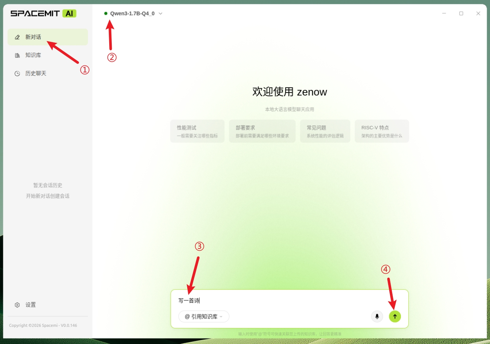

The app will automatically create a conversation session, supporting multi-turn continuous dialogue with context memory.


### Knowledge Base Management

#### Create a Knowledge Base

1. Click **Knowledge Base** in the left navigation bar
2. Click the **New Knowledge Base** button
3. Fill in the knowledge base name and description
4. Optionally customize the avatar

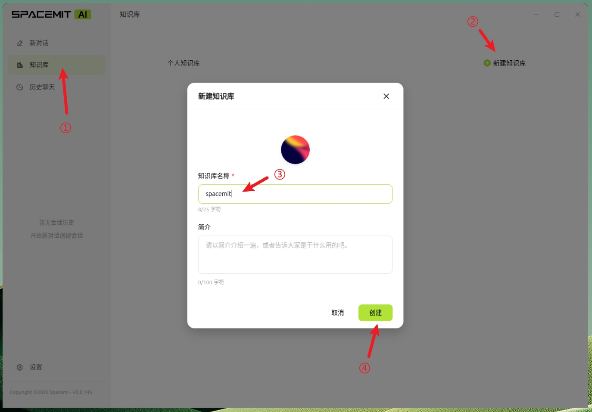

#### Import Documents

1. Enter the created knowledge base
2. Click the **Add Documents** button
3. Select files to upload (hold Ctrl for multiple selection)
4. Wait for document processing to complete


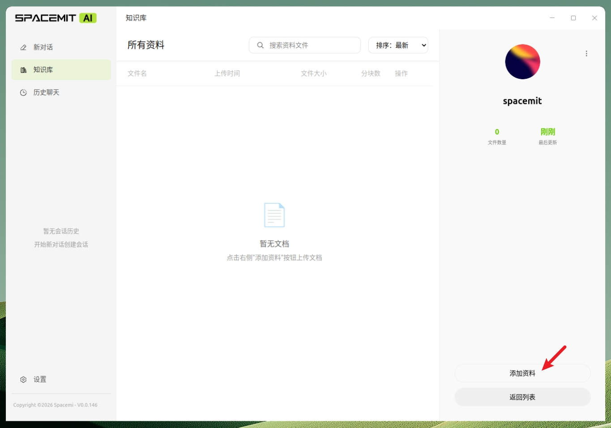

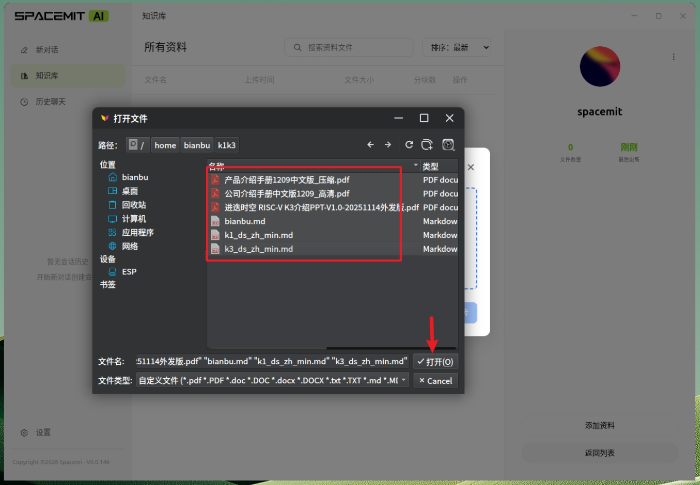
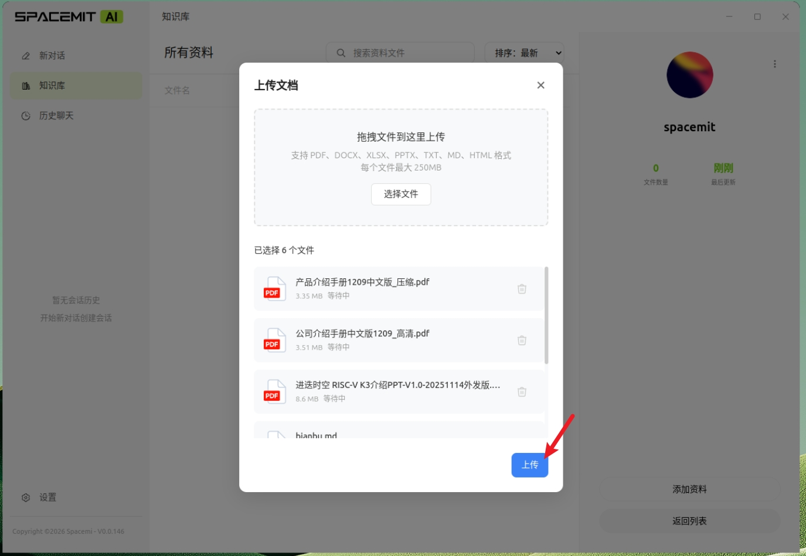

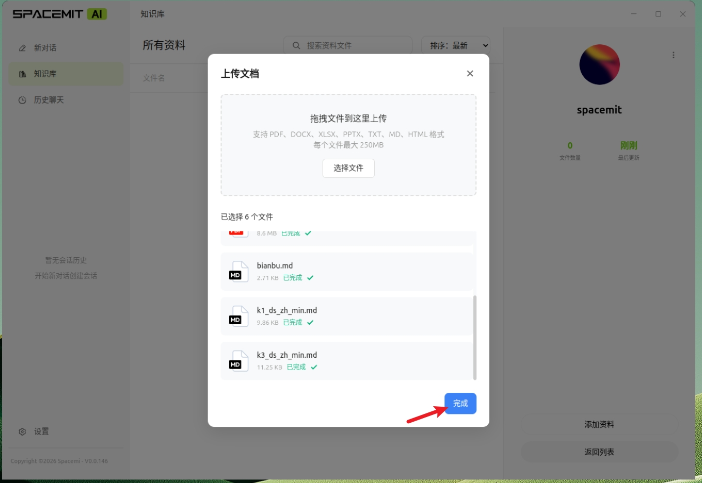


#### Chat with Knowledge Base

1. Select a new conversation or choose a history session
2. In the input box, type @, then select the knowledge base you want to use from the selection menu
3. Enter your question and press Enter, the AI will answer based on the knowledge base content


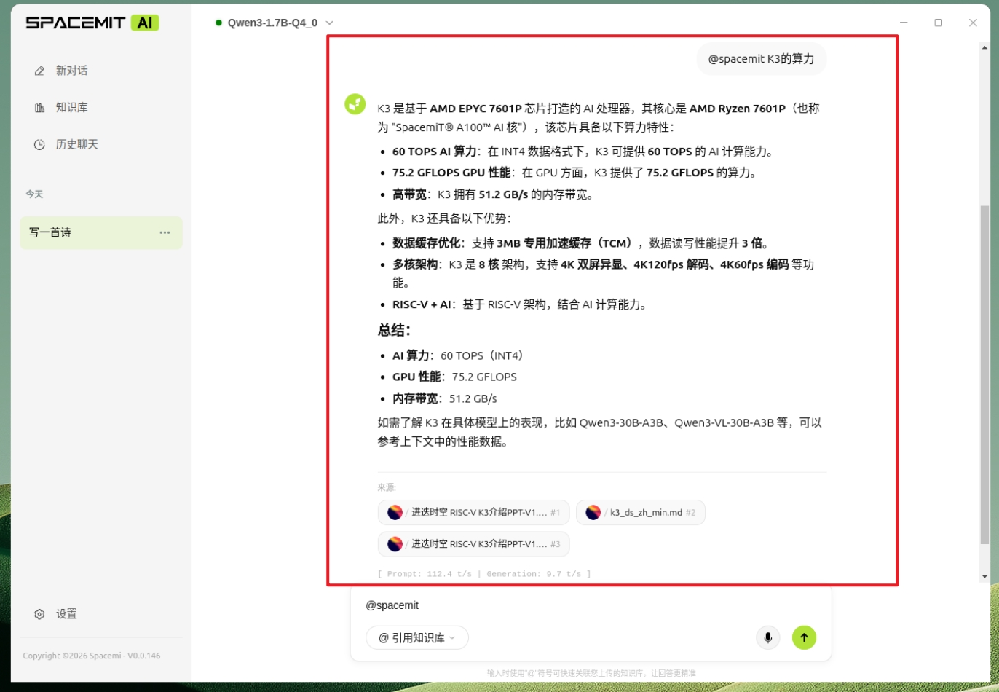

### Voice Interaction

#### Voice Input

**Method 1: Voice Wake-up**
- After connecting a microphone, say "Xiao Die Xiao Die" to wake up
- The voice orb lights up to indicate recording has started
- Automatically sends after 3 seconds of silence

**Method 2: Manual Start**
- Click the voice button next to the input box
- Start speaking
- Automatically sends after 3 seconds of silence

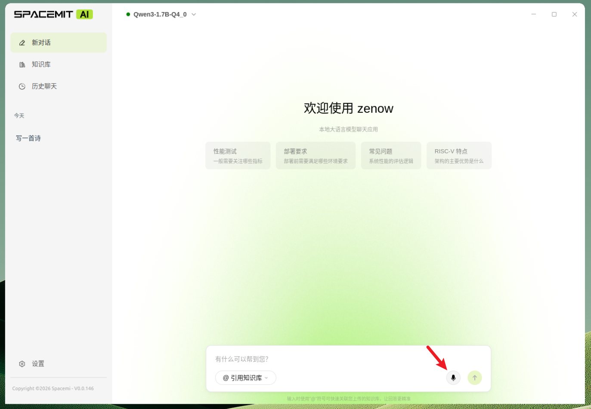


#### Text-to-Speech

1. Go to the **Settings** page
2. Find the **Text-to-Speech** option
3. Once enabled, AI responses will be automatically read aloud


## Advanced Settings

### LLM Model Parameters

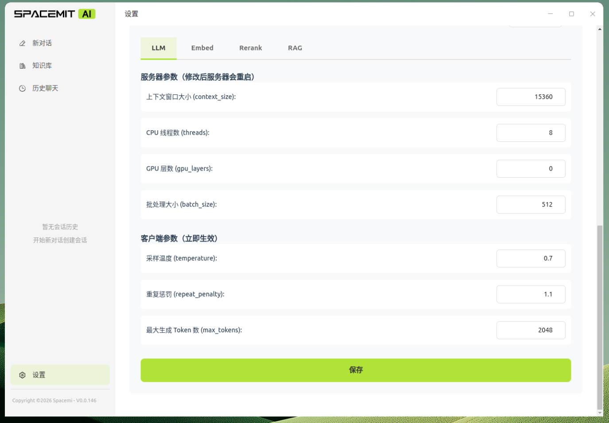

**Server Parameters**
- **Context Window**: Maximum text length the model can process
- **CPU Threads**: Number of CPU threads for inference
- **GPU Layers**: Number of model layers loaded to GPU (K3 platform supported)
- **Batch Size**: Number of parallel requests

**Client Parameters**
- **Sampling Temperature**: Controls output randomness (higher = more random)
- **Repetition Penalty**: Degree of reducing repetitive content
- **Max Generated Tokens**: Maximum length of a single response

### Embed Model Parameters


**Server Parameters**
- **Context Window**: Maximum length for text vectorization
- **CPU Threads**: Number of inference threads
- **GPU Layers**: Number of GPU acceleration layers
- **Batch Size**: Batch processing quantity

**Client Parameters**
- **Normalize Vectors**: Whether to normalize vectors
- **Truncate Long Text**: How to handle overly long text

### Rerank Model Parameters

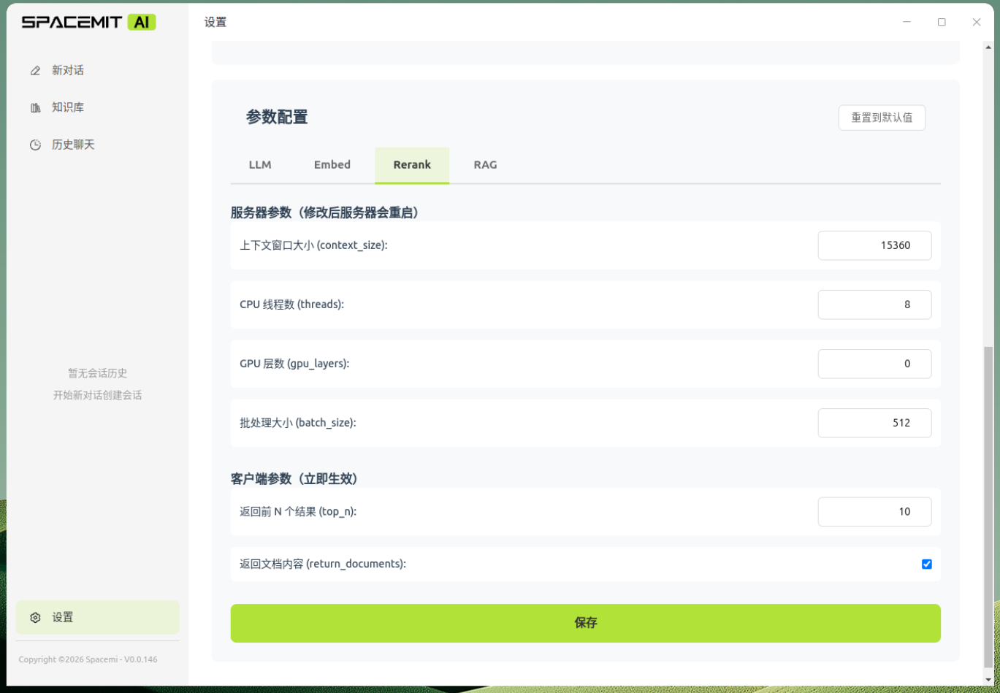

**Server Parameters**
- **Context Window**: Maximum text length for reranking
- **CPU Threads**: Number of inference threads
- **GPU Layers**: Number of GPU acceleration layers
- **Batch Size**: Batch processing quantity

**Client Parameters**
- **Return Top N Results**: Number of most relevant results to keep
- **Return Document Content**: Whether to include original content

### RAG Retrieval Parameters


**Retrieval Flow Parameters**

- **top_k (Final Return Count)**
  - Number of document chunks finally returned to LLM
  - Result count after all retrieval and reranking
  - Range: 1-20

- **initial_k (Initial Retrieval Count)**
  - Number of candidate documents in the first stage
  - Used for vector search and BM25 keyword search
  - Range: 10-200
  - Higher values increase recall but also computational cost

- **intermediate_k (Intermediate Result Count)**
  - Number of documents retained after RRF fusion
  - Candidate set size before reranking
  - Range: 5-50
  - Between initial_k and top_k

- **embed_weight (Vector Weight)**
  - Weight of vector search in hybrid retrieval
  - Range: 0-1, step 0.1
  - Controls importance of semantic similarity

- **bm25_weight (Keyword Weight)**
  - Weight of BM25 keyword search
  - Range: 0-1, step 0.1
  - Controls importance of exact keyword matching

**Retrieval Flow Description**

1. **First Stage**: Vector search and BM25 each retrieve initial_k results
2. **Fusion Stage**: Use RRF algorithm to fuse, keeping intermediate_k results
3. **Reranking Stage**: Use rerank model to re-sort
4. **Final Output**: Return top_k results to LLM

### Prompt Configuration

**conversation_system_prompt (Conversation System Prompt)**
- Used for normal conversation mode
- Defines AI's role, behavior, and response style
- Takes effect when not using knowledge base
- Example: "You are a helpful AI assistant, please answer questions in a concise and professional manner"

**rag_system_prompt_template (RAG System Prompt Template)**
- Used for knowledge base Q&A mode
- Must include `{context}` placeholder
- Takes effect when using @knowledge base
- `{context}` will be replaced with retrieved relevant document content

## Performance Reference

The following is performance test data on the K3 platform (Test date: 2026-04-03)

### Knowledge Base Vectorization Performance

| Item | Value |
| --- | --- |
| Test File | 4.2 KB text file |
| Document Chunks | 5 |
| Upload Time | 55 ms |
| Vectorization Time | 2364 ms |
| Total Time | 2419 ms |
| Average per Chunk | 473 ms |

### Qwen3-0.6B-Q4_0 Model Performance

**Normal Q&A** (5 test average)

| Metric | Value |
| --- | --- |
| Time to First Token | 239 ms |
| Average Total Time | 2355 ms |
| Generation Speed | 35.2 tokens/s |
| Average Generation Length | 72 tokens |

**Multi-Turn Conversation** (5 rounds test)

| Round | First Token | Total Time | Generation Speed | Token Count |
| :--: | --: | --: | --: | --: |
| 1 | 170 ms | 569 ms | 38.8 t/s | 14 |
| 2 | 342 ms | 812 ms | 37.4 t/s | 16 |
| 3 | 365 ms | 2286 ms | 33.6 t/s | 63 |
| 4 | 565 ms | 2999 ms | 31.0 t/s | 74 |
| 5 | 650 ms | 2354 ms | 29.0 t/s | 47 |

**Knowledge Base Q&A** (5 test average)

| Metric | Value |
| --- | --- |
| Time to First Token (with retrieval) | 5118 ms |
| Average Total Time | 17314 ms |
| Generation Speed | 19.3 tokens/s |
| Average Generation Length | 231 tokens |
| Average Hit Chunks | 3.0 |

### Qwen3-1.7B-Q4_0 Model Performance

**Normal Q&A** (5 test average)

| Metric | Value |
| --- | --- |
| Time to First Token | 455 ms |
| Average Total Time | 19365 ms |
| Generation Speed | 15.6 tokens/s |
| Average Generation Length | 281 tokens |

**Multi-Turn Conversation** (5 rounds test)

| Round | First Token | Total Time | Generation Speed | Token Count |
| :--: | --: | --: | --: | --: |
| 1 | 254 ms | 3119 ms | 16.6 t/s | 46 |
| 2 | 1107 ms | 4037 ms | 16.2 t/s | 46 |
| 3 | 1138 ms | 22563 ms | 14.9 t/s | 301 |
| 4 | 2965 ms | 30945 ms | 13.1 t/s | 341 |
| 5 | 4128 ms | 15247 ms | 12.1 t/s | 132 |

**Knowledge Base Q&A** (5 test average)

| Metric | Value |
| --- | --- |
| Time to First Token (with retrieval) | 8328 ms |
| Average Total Time | 57517 ms |
| Generation Speed | 11.4 tokens/s |
| Average Generation Length | 530 tokens |
| Average Hit Chunks | 3.0 |

### Qwen3-30B-A3B-Instruct-2507-Q4_0 Model Performance

**Normal Q&A** (5 test average)

| Metric | Value |
| --- | --- |
| Time to First Token | 747 ms |
| Average Total Time | 62338 ms |
| Generation Speed | 8.8 tokens/s |
| Average Generation Length | 490 tokens |

**Multi-Turn Conversation** (5 rounds test)

| Round | First Token | Total Time | Generation Speed | Token Count |
| :--: | --: | --: | --: | --: |
| 1 | 483 ms | 6852 ms | 9.9 t/s | 62 |
| 2 | 714 ms | 7101 ms | 9.6 t/s | 60 |
| 3 | 773 ms | 56768 ms | 8.2 t/s | 425 |
| 4 | 1253 ms | 91724 ms | 6.2 t/s | 532 |
| 5 | 2215 ms | 57670 ms | 5.2 t/s | 273 |

**Knowledge Base Q&A** (5 test average)

| Metric | Value |
| --- | --- |
| Time to First Token (with retrieval) | 28623 ms |
| Average Total Time | 165871 ms |
| Generation Speed | 5.4 tokens/s |
| Average Generation Length | 677 tokens |
| Average Hit Chunks | 3.0 |

> 💡 **Performance Notes**:
> - Larger models provide higher quality but slower speed
> - Knowledge base Q&A includes document retrieval time and longer input context from retrieved chunks, resulting in slower responses than normal conversations

## FAQ

### What if model download fails?

- Check if network connection is normal
- Confirm sufficient disk space
- Try downloading again

### What if model fails to start (red light)?

- Check if system resources are sufficient (memory), 30B models require 32GB or more memory

### What if knowledge base Q&A results are poor?

- Ensure LLM, Embed, and Rerank models are all started
- Adjust RAG retrieval parameters (top_k, initial_k, embed_weight, bm25_weight, etc.)
- Check if uploaded document content is relevant

### How to improve response speed?

- Choose smaller models (e.g., 1.7B instead of 30B)
- Reduce context window size

### Voice wake-up not working?

- Confirm microphone is properly connected
- Check system audio permission settings
- Try manually clicking the voice button to test
