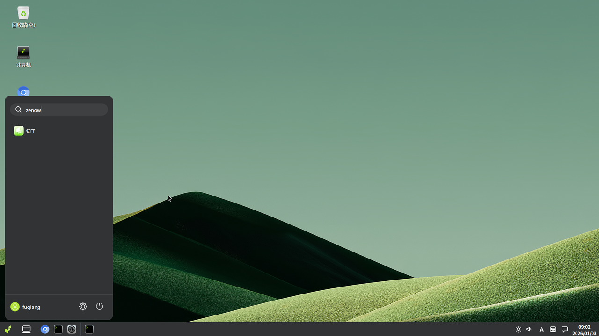
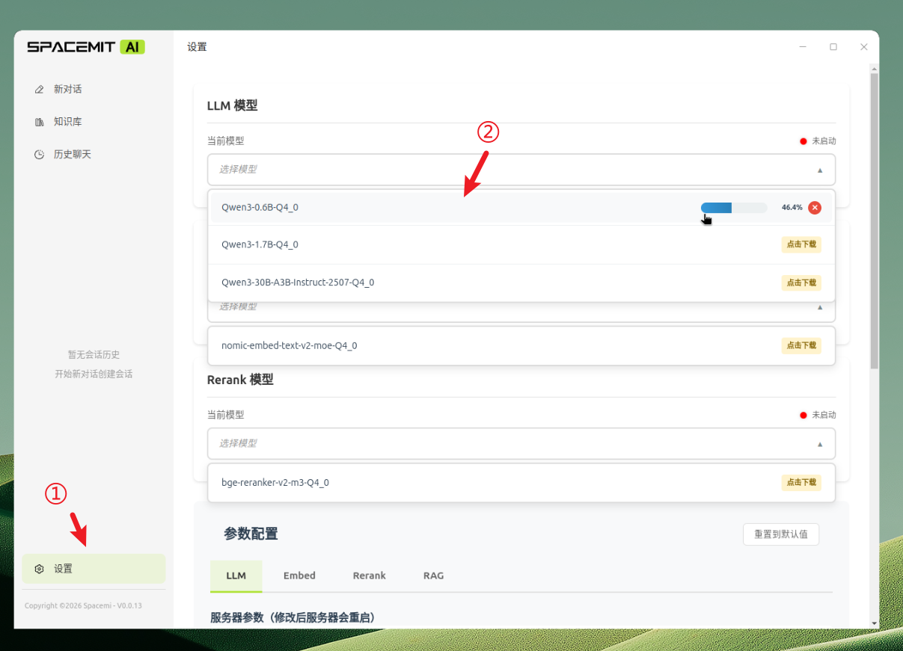

# Zenow

**Zenow** is a locally-running AI knowledge assistant desktop application built on Electron + React + FastAPI. It runs GGUF-format large language models locally via llama-server, supporting multi-model parallel management, knowledge base Q&A, and full user data privacy.

## Installation

### Install the Software

If the package sources have already been updated, you can skip directly to `update` and `install`.

```bash
# Update package sources
sudo apt update

# Install zenow and dependencies
sudo apt install zenow llm-sdk sm-sdk
```

### Getting Started

After installation, click the **Start Menu** in the bottom-left corner and search for **zenow** to launch the application.

> 💡 You can right-click the app icon and select "Add to Desktop" for quick access next time.




**Download a Model:**

Go to the **Settings** page, open the model list, and click a model to start downloading.



You can click multiple models at once to download them in parallel.


**Enable a Model:**

Once downloaded, click the model again. Wait for the status indicator to turn from red to green (indicating the model has started successfully).


> To ensure full knowledge base functionality, it is recommended to download and start at least one **LLM**, one **Embed**, and one **Rerank** model.

Once the models are running, you can start using **New Chat** and **Knowledge Base** features.
