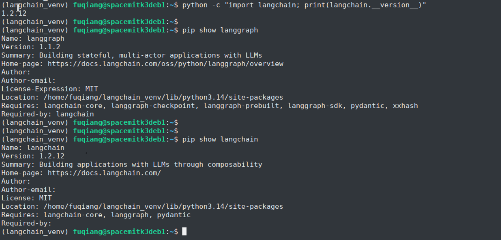

# langchain

## 平台支持情况

| 平台&系统     | 是否支持 |
|----------|------------|
| K1 Bianbu LXQT/GNOME       | 不支持        |
| K1 Buildroot   | 不支持 |
| K1 OpenHarmony5.0 | 不支持 |
| K3 Bianbu LXQT/GNOME      | 支持        |
| K3 Buildroot   | 不支持 |

## 安装

### 1.1. 安装依赖

安装基本依赖：
```bash
sudo apt update
sudo apt install python3-venv libffi-dev libssl-dev pkg-config
```

安装rust：
```bash
curl --proto '=https' --tlsv1.2 -sSf https://sh.rustup.rs | sh -s -- -y --default-toolchain stable
source ~/.cargo/env
rustc --version
```

有如下打印说明安装成功：


### 1.2. 安装langchain
 
```bash
python3 -m venv ./langchain_venv
source langchain_venv/bin/activate
pip install langchain  -i https://pypi.tuna.tsinghua.edu.cn/simple
```

## 使用

```bash
source langchain_venv/bin/activate
python -c "import langchain; print(langchain.__version__)"
```

