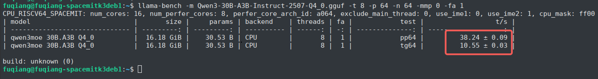
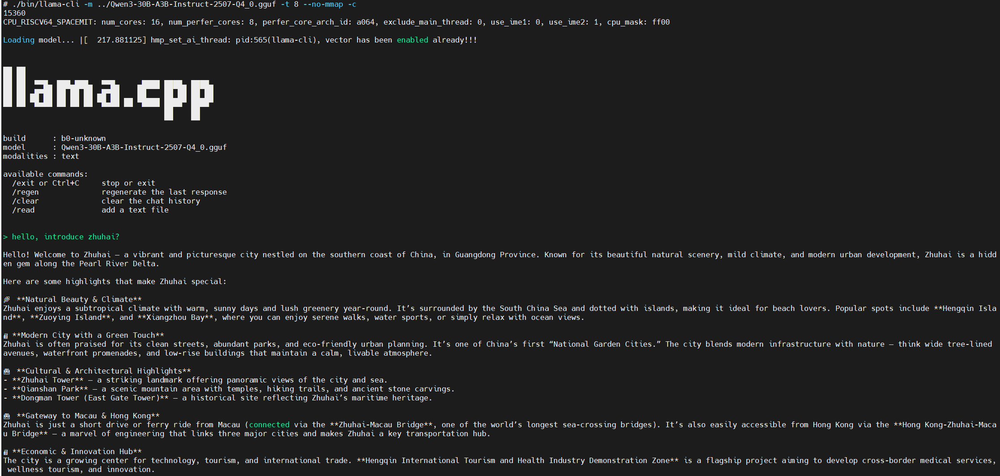

<!--
 * Copyright 2022-2023 SPACEMIT. All rights reserved.
 * Use of this source code is governed by a BSD-style license
 * that can be found in the LICENSE file.
 * 
 * @Author: David(qiang.fu@spacemit.com)
 * @Date: 2026-02-28 14:50:46
 * @LastEditTime: 2026-03-02 11:23:35
 * @FilePath: \doc\docs-bianbu\zh\ai\llama-cpp.md
 * @Description: 
-->

---
sidebar_position: 2
---

# llama.cpp


**llama.cpp** 是一个用纯 C/C++ 写的开源推理框架，专门让 Llama 等 GGUF/GGML 格式的大语言模型能在本地 CPU/GPU（笔记本、手机、树莓派甚至浏览器）快速运行，而无需依赖重量级框架。

## 平台支持情况

| 平台&系统     | 是否支持加速 |
|----------|------------|
| K1 Bianbu LXQT/GNOME       | 支持        |
| K1 Buildroot   | 支持 |
| K1 OpenHarmony5.0 | 不支持 |
| K3 Bianbu LXQT/GNOME      | 支持        |
| K3 Buildroot   | 支持 |

目前支持5种量化格式的加速模型：
- Q4_K_M
- Q4_0
- Q4_1
- Q2_K
- Q3_K

## Bianbu LXQT/GNOME环境使用说明

### 安装

打开终端，执行如下命令安装llama.cpp

```bash
sudo apt update
sudo apt install llama.cpp-tools-spacemit
```

### 下载模型

根据芯片平台的算力下载合适参数的模型，K1平台推荐Qwen3-0.6B，下载方法如下：

```bash
wget https://www.modelscope.cn/models/unsloth/Qwen3-0.6B-GGUF/resolve/master/Qwen3-0.6B-Q4_0.gguf -P ~/
```

K3平台推荐Qwen3-30B-A3B，下载方法如下：

```bash
wget https://www.modelscope.cn/models/unsloth/Qwen3-30B-A3B-Instruct-2507-GGUF/resolve/master/Qwen3-30B-A3B-Instruct-2507-Q4_0.gguf -P ~/
```

### 使用

有3种常见的使用方法
- llama-bench
- llama-cli
- llama-server

下面以K3平台为例，分别介绍

#### llama-bench


```bash
llama-bench -m Qwen3-30B-A3B-Instruct-2507-Q4_0.gguf -t 8 -p 64 -n 64 -mmp 0 -fa 1
```

输出结果如下：



#### llama-cli

```bash
llama-cli -m Qwen3-30B-A3B-Instruct-2507-Q4_0.gguf -t 8 --no-mmap -c 15360
```

输出结果如下：


#### llama-server

启动后台llama-server服务：

```bash
llama-server -m Qwen3-30B-A3B-Instruct-2507-Q4_0.gguf -t 8 --host 127.0.0.1 --port 8080 --ctx-size 15360 --n-gpu-layers 0 --batch-size 512 --metrics --no-mmap &
```

##### 本地API请求

```bash
curl -X POST http://127.0.0.1:9090/v1/chat/completions \
  -H "Content-Type: application/json" \
  -d '{
        "model": "Qwen3-30B",
        "messages": [
          { "role": "user", "content": "介绍珠海？" }
        ]
      }'
```

输出结果如下：


##### 浏览器请求

在浏览器中搜索 `http://localhost:8080` 打开 llama 服务器，直接在浏览器中使用 llama.cpp


## Buildroot环境使用说明

### 安装

#### 下载

- 从[这里](https://archive.spacemit.com/spacemit-ai/llama.cpp/)下载进迭官方发布的llama.cpp，并通过scp等方式拷贝到设备上
- 通过wget命令下载（后面以0.0.5版本为例）
```bash
wget http://archive.spacemit.com/spacemit-ai/llama.cpp/spacemit-llama.cpp.riscv64.0.0.5.tar.gz
```
#### 解压

```bash
tar -zxvf spacemit-llama.cpp.riscv64.0.0.5.tar.gz
```

#### 设置LD_LIBRARY_PATH

```bash
export LD_LIBRARY_PATH=/root/spacemit-llama.cpp.riscv64.0.0.5/lib/
```

### 下载模型

根据芯片平台的算力下载合适参数的模型，K1平台推荐Qwen3-0.6B，下载方法如下：

```bash
wget https://www.modelscope.cn/models/unsloth/Qwen3-0.6B-GGUF/resolve/master/Qwen3-0.6B-Q4_0.gguf -P ~/
```

K3平台推荐Qwen3-30B-A3B，下载方法如下：

```bash
wget https://www.modelscope.cn/models/unsloth/Qwen3-30B-A3B-Instruct-2507-GGUF/resolve/master/Qwen3-30B-A3B-Instruct-2507-Q4_0.gguf -P ~/
```

**注意**：如果Buildroot中的wget不支持https路径文件的下载，报（wget: not an http or ftp url:），需要单独下载后通过scp等方式拷贝到设备中

### 使用

有3种常见的使用方法
- llama-bench
- llama-cli
- llama-server

下面以K3平台为例，分别介绍

#### llama-bench


```bash
cd spacemit-llama.cpp.riscv64.0.0.5
./bin/llama-bench -m ../Qwen3-30B-A3B-Instruct-2507-Q4_0.gguf -t 8 -p 64 -n 64
```

输出结果如下：


#### llama-cli

```bash
cd spacemit-llama.cpp.riscv64.0.0.5
./bin/llama-cli -m ../Qwen3-30B-A3B-Instruct-2507-Q4_0.gguf -t 8 --no-mmap -c 15360
```

输出结果如下：


#### llama-server

启动后台llama-server服务：

```bash
./bin/llama-server -m ../Qwen3-30B-A3B-Instruct-2507-Q4_0.gguf -t 8 --host 127.0.0.1 --port 8080 --ctx-size 15360 --n-gpu-layers 0 --batch-size 512 --metrics --no-mmap &
```

##### 本地API请求

```bash
curl -X POST http://127.0.0.1:9090/v1/chat/completions \
  -H "Content-Type: application/json" \
  -d '{
        "model": "Qwen3-30B",
        "messages": [
          { "role": "user", "content": "introduce zhuhai？" }
        ]
      }'
```

**注意**：Buildroot未安装curl，暂未验证

##### 浏览器请求

Buildroot中无浏览器，暂未验证