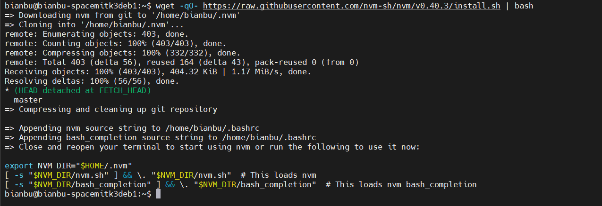
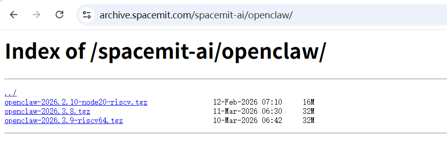
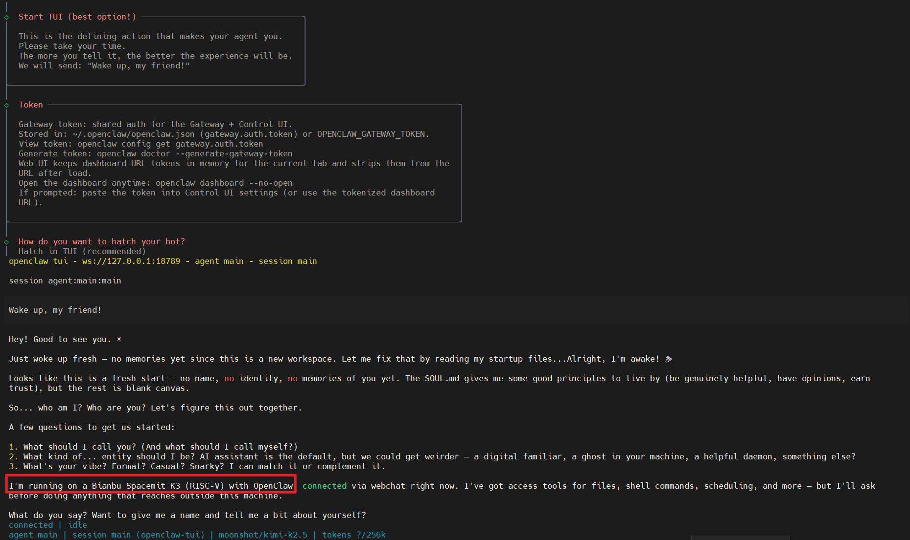
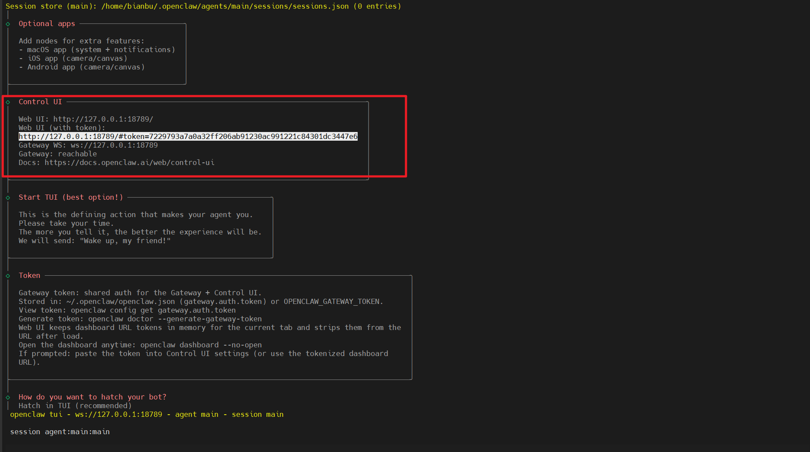

# openClaw
## 环境要求
- 平台: Linux RISC-V 64
- Node.js: >= 22.12.0
- 包管理器: pnpm 10.23.0
- 硬件：K1/K3 开发板

## 普通用户安装  OpenClaw
### 1. 安装nvm ，用于node version的管理
wget -qO- https://raw.githubusercontent.com/nvm-sh/nvm/v0.40.3/install.sh | bash

如果nvm找到，执行下下面的命令：
export NVM_DIR="$HOME/.nvm"
[ -s "$NVM_DIR/nvm.sh" ] && \. "$NVM_DIR/nvm.sh"  # This loads nvm
[ -s "$NVM_DIR/bash_completion" ] && \. "$NVM_DIR/bash_completion"

### 2. 下载npm安装包
https://archive.spacemit.com/spacemit-ai/openclaw/

### 3. 安装nodejs22：
K3：
NVM_NODEJS_ORG_MIRROR=https://archive.spacemit.com/nodejs/k3 nvm install 22

如果是K1：
NVM_NODEJS_ORG_MIRROR=https://archive.spacemit.com/nodejs/k1 nvm install 22

nvm use 22

### 4. 安装openclaw 
npm install -g --legacy-peer-deps ./openclaw-2026.3.9-riscv64.tgz

### 5. 配置openclaw
执行 openclaw onboard 开始配置 
安装结束开始配置openclaw，我这边配置的是kimi模型

打开webui
在浏览器输出：http://127.0.0.1:18789/#token=7229793a7a0a32ff206ab91230ac991221c84301dc3447e6
后面token是在配置结束后，控制台显示的那行

## 开发者用户 构建安装、二次开发openclaw
### 代码仓库：
https://github.com/SpaceX-mit/openclaw-riscv64

### 指南：

https://github.com/SpaceX-mit/openclaw-riscv64/blob/main/BUILD_RUN_GUIDE.md

https://github.com/SpaceX-mit/openclaw-riscv64/blob/main/PACKAGE_BUILD_COMPLETE.md

## 官方参考：
https://github.com/openclaw/openclaw
https://www.openclawcenter.com/
