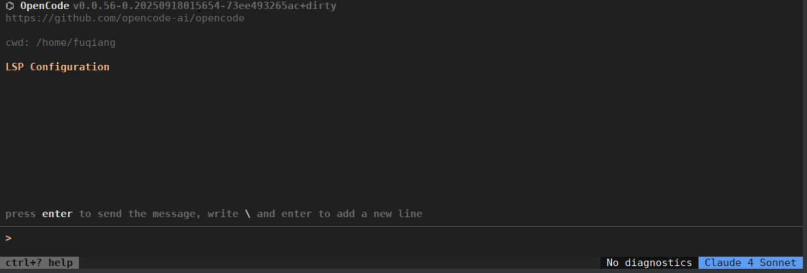
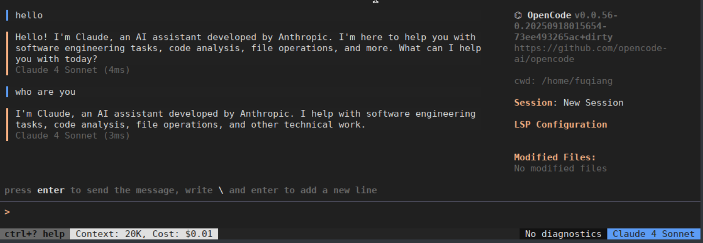
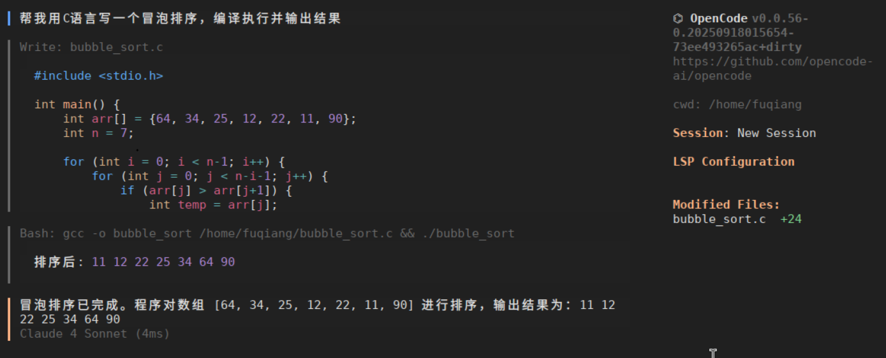
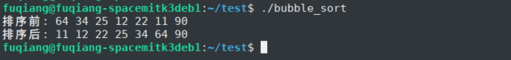

<!--
 * Copyright 2022-2023 SPACEMIT. All rights reserved.
 * Use of this source code is governed by a BSD-style license
 * that can be found in the LICENSE file.
 *
 * @Author: David(qiang.fu@spacemit.com)
 * @Date: 2026-03-10 16:30:02
 * @LastEditTime: 2026-03-18 20:45:01
 * @FilePath: \doc\docs-bianbu\zh\ai\opencode.md
 * @Description:
-->
---
sidebar_position: 9
---

# OpenCode

OpenCode 是一款开源的 AI 编程助手（AI coding agent），支持在终端、桌面应用和主流 IDE 中通过自然语言交互，帮助开发者完成代码编写、调试、重构、项目分析等任务‌。它兼容多种大语言模型（如 Claude、GPT-4、Qwen 等），并通过独特的双模式工作流提升开发效率。‌‌

## 平台支持情况

|      平台 & 系统       |       是否支持加速      |
|-----------------------|-----------------------|
| K1 Buildroot          | ❌ 不支持              |
| K1 OpenHarmony5.0     | ❌ 不支持              |
| K3 Bianbu LXQT/GNOME  | ✅ 支持                |

## 1. 安装

因OpenCode的安装包不支持RISC-V，只能通过源码构建

### 1.1. 安装依赖

```shell
sudo apt install golang-go ripgrep fzf
```

### 1.2. 下载OpenCode源码

```bash
git clone https://github.com/opencode-ai/opencode.git
```

### 1.3. 编译

```bash
cd opencode
go build -o opencode
```
编译完成后，会在**opencode**目录生成可执行文件opencode，在~目录生成.opencode.json

可以将可执行文件opencode复制到/usr/bin/目录下，方便使用
```bash
sudo cp opencode /usr/bin/
sudo chmod 755 /usr/bin/opencode
```

## 2. 配置
按照格式要求配置~/.opencode.json

## 3. 使用

启动 opencode 交互式会话:

```bash
opencode
```

启动界面如下:


Say Hello(使用了Claude的API)：


## 4. 举一个例子

- 输入“帮我用C语言写一个冒泡排序，编译执行并输出结果”，OpenCode开始运行，完成了编码，编译和自动运行


- 单独执行编译生成的bin文件，也能得到正确结果

