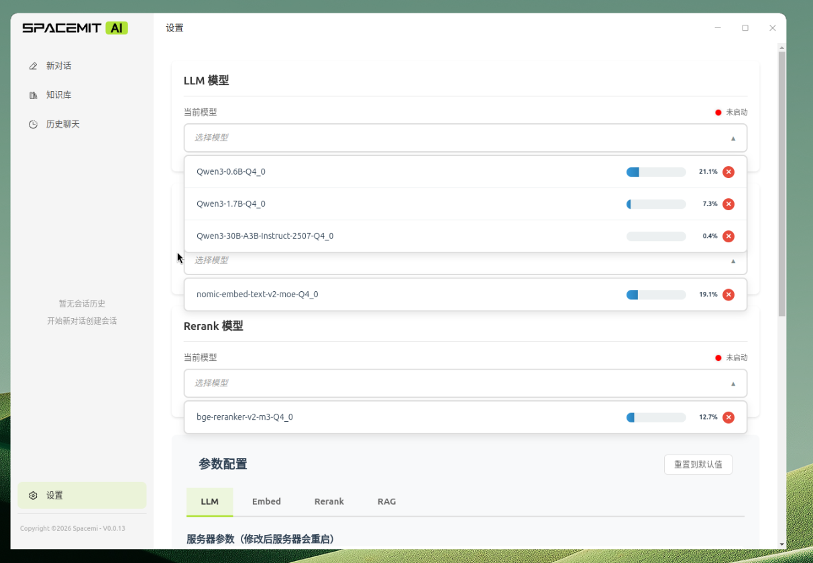
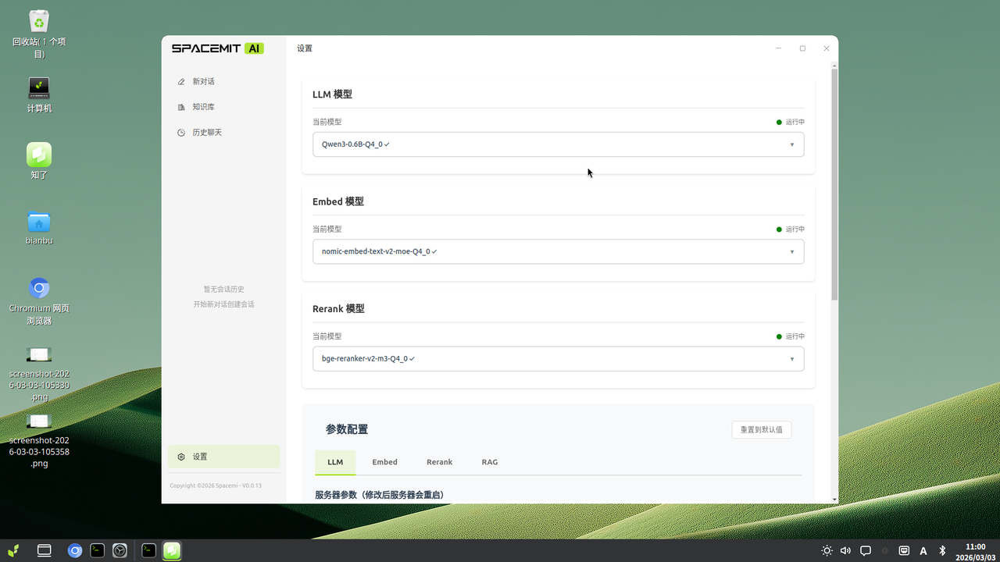

# 知了（zenow）

**知了（zenow）** 是一款运行于本地的 AI 知识助手桌面应用，基于 Electron + React + FastAPI 构建，通过 llama-server 在本地运行 GGUF 格式的大语言模型，支持多模型并行管理、知识库问答等功能，保护用户数据隐私。

## 安装步骤

### 安装软件

若已修改过源文件，直接执行 `update` 和 `install` 即可。

```bash
# 更新源
sudo apt update

# 确保所有包都是最新
sudo apt install zenow llm-sdk sm-sdk
```

### 使用软件

安装完成后，点击左下角 Windows 菜单，搜索 **zenow** 或 **知了** 即可找到并启动应用。

> 💡 可右键应用图标，选择"添加到桌面"，方便下次快速启动。


**下载模型：**

进入**设置页面**，点击模型列表，选择所需模型即可开始下载。


支持同时点击多个模型并发下载。




**启用模型：**

下载完成后，再次点击已下载的模型，等待状态灯由红色变为绿色（提示"模型启动成功"），即可开始使用。




> 为保障知识库功能的完整性，建议至少各下载并启动一个 **LLM**、**Embed**、**Rerank** 模型。

启动成功后即可使用**新对话**和**知识库**等功能。


